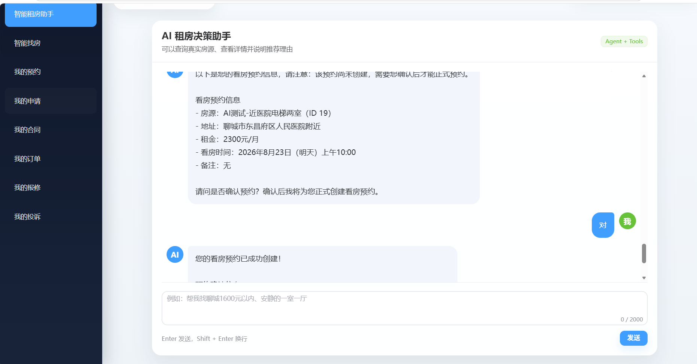
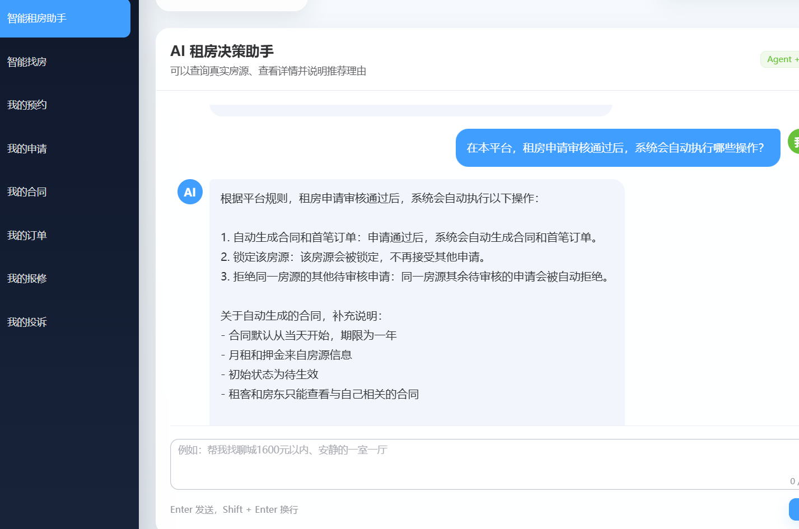
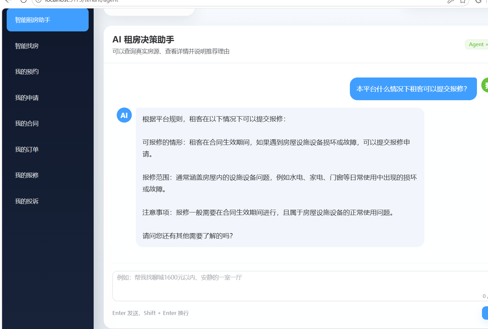
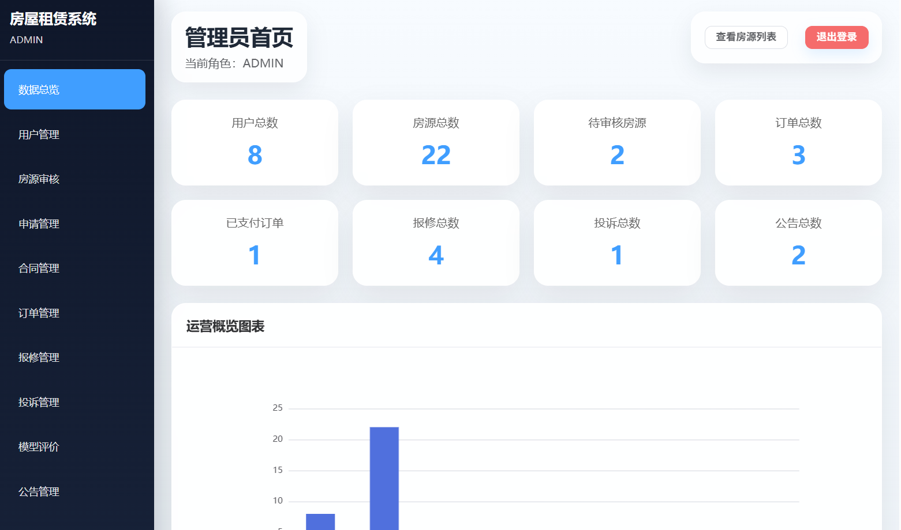
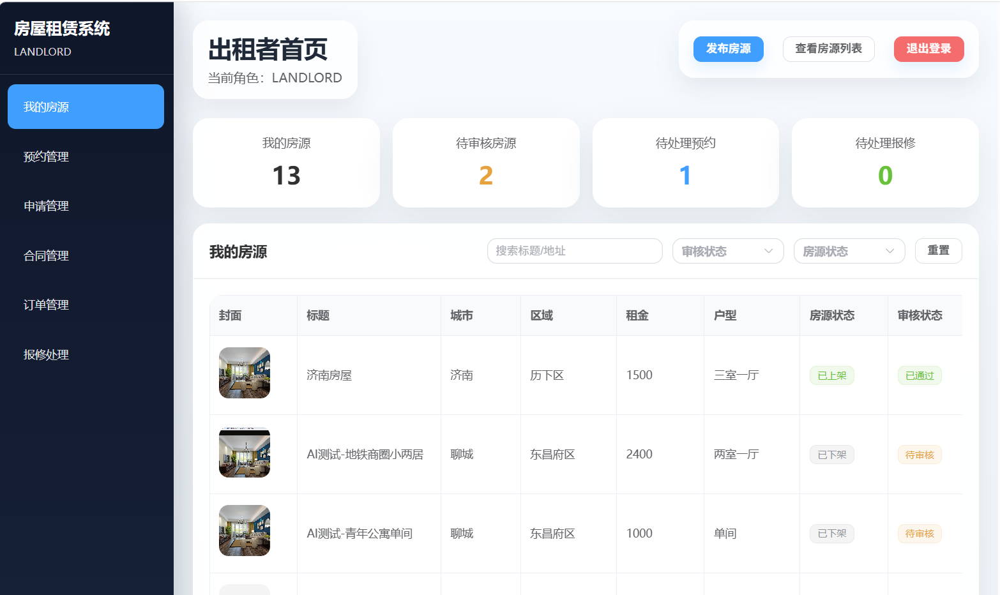

# 基于大模型 Agent 的房屋租赁与决策系统

这是一个覆盖房源、预约、租房申请、合同、订单、报修和投诉完整流程的房屋租赁系统。在传统租赁业务基础上，项目增加了独立的智能租房助手，支持真实房源查询、推荐与对比、预算测算、预约二次确认、短期对话记忆、长期租房偏好和轻量级 RAG 知识问答。

## 核心能力

- 三类角色：管理员、出租者、租客
- 完整业务：房源审核、看房预约、租房申请、合同、订单、报修、投诉、公告
- 智能决策：自然语言查房、规则推荐、TF-IDF 推荐、房源对比、预算测算
- Agent 办理：LangGraph Tool Calling 和看房预约二次确认
- 记忆系统：Redis 短期会话状态，MySQL 结构化长期租房偏好
- 知识问答：`sqlite-vec` 本地向量检索，覆盖平台办理流程
- GitHub 安全：密钥通过环境变量配置，本地环境和生成文件均已忽略

## 系统展示

### Agent 预约二次确认

智能助手先展示房源、地址、租金、看房时间和备注。只有租客在下一轮明确确认后，系统才通过业务接口正式创建预约，避免模型误操作。



### RAG 平台知识问答

以下问答检索的是本项目知识库中的租房申请、合同订单和报修流程，不使用模型常识编造平台规则。

| 租房申请审核通过后的自动流程 | 租客报修条件 |
|---|---|
|  |  |

### 多角色业务后台

| 管理员数据总览 | 出租者房源管理 |
|---|---|
|  |  |

## RAG 工作流程

```text
用户询问平台办理规则
        ↓
LangGraph Agent 判断为知识问答
        ↓
调用 search_rental_knowledge
        ↓
轻量字符特征向量化
        ↓
sqlite-vec 检索 TopK 知识片段
        ↓
DeepSeek 依据检索内容组织回答
```

知识源位于 `agent-service/knowledge/`。向量索引由 `python -m app.rag.ingest` 在本地生成，索引文件不提交到 Git。

## 系统架构

```text
Vue 3 + Vite
      |
      | HTTP / Axios
      v
Spring Boot + MyBatis-Plus
      |                         |
      | MySQL / Redis           | HTTP
      v                         v
业务数据与状态          FastAPI + LangGraph Agent
                                |
                    +-----------+-----------+
                    |           |           |
                 DeepSeek    业务 Tools   sqlite-vec RAG
```

职责划分：

- Spring Boot 负责鉴权、业务规则和数据库操作。
- Python Agent 负责理解用户意图、选择工具和编排多轮任务。
- Agent 不直接访问 MySQL，真实业务操作统一调用 Spring Boot 接口。
- Vue 前端通过 Spring Boot 的 Agent 转发接口访问智能助手。

## 项目目录

```text
house-rental-server/      Spring Boot 业务后端
house-rental-web/         Vue 3 前端
agent-service/            FastAPI + LangGraph 智能助手
ai-recommend-service/     旧版本地语义推荐服务（低内存模式不要求启动）
house_rental.sql          MySQL 初始化及演示数据
```

## 技术栈

| 模块 | 技术 |
|---|---|
| 前端 | Vue 3、Vite、Element Plus、Axios、Pinia、ECharts |
| 后端 | Java 17、Spring Boot 3、MyBatis-Plus、Spring Security |
| Agent | Python 3.11、FastAPI、LangGraph、OpenAI SDK |
| 大模型 | DeepSeek API |
| 数据 | MySQL 8、Redis、SQLite + sqlite-vec |
| 推荐 | 规则模型、TF-IDF；旧版 EMBEDDING 服务可选 |

## 环境要求

- JDK 17
- MySQL 8.x
- Redis（本项目开发时使用 Docker Redis）
- Node.js 20.19+ 或 22.12+
- Python 3.11
- Maven（可使用 IntelliJ IDEA 内置 Maven）

本项目的低内存开发模式不启动旧版 `ai-recommend-service`，也不加载 `sentence-transformers` 本地模型。

## 首次配置

### 1. 初始化 MySQL

创建数据库：

```sql
CREATE DATABASE house_rental
  DEFAULT CHARACTER SET utf8mb4
  COLLATE utf8mb4_general_ci;
```

随后导入根目录的 `house_rental.sql`。

### 2. 配置 Spring Boot

后端配置文件为 `house-rental-server/src/main/resources/application.yml`，支持以下环境变量：

| 变量 | 用途 |
|---|---|
| `DB_URL` | MySQL 连接地址 |
| `DB_USERNAME` | MySQL 用户名 |
| `DB_PASSWORD` | MySQL 密码 |
| `REDIS_HOST`、`REDIS_PORT` | Redis 地址和端口 |
| `REDIS_PASSWORD` | Redis 密码，无密码可留空 |
| `DEEPSEEK_API_KEY` | 后端旧推荐解析使用的 DeepSeek Key |
| `AGENT_CHAT_URL` | Agent 聊天接口地址 |

本地开发可以在 IntelliJ IDEA 的运行配置中添加这些变量。不要把真实密码或 API Key 写入 Git。

### 3. 配置 Agent

进入 `agent-service`，复制示例配置：

```cmd
copy .env.example .env
```

打开 `.env`，至少填写：

```text
DEEPSEEK_API_KEY=你的DeepSeek密钥
```

`.env` 已被忽略，不会上传 GitHub。

### 4. 安装依赖

以下命令只需要在首次配置或依赖变化时运行：

```cmd
cd house-rental-web
npm install
```

```cmd
cd agent-service
py -3.11 -m venv .venv
.venv\Scripts\activate
python -m pip install -r requirements.txt
```

## 启动顺序

开发时按以下顺序启动，避免同时运行不需要的重型服务：

1. MySQL
2. Docker 中的 Redis 容器
3. Spring Boot 后端
4. Python Agent
5. Vue 前端

### Spring Boot

在 IntelliJ IDEA 中运行 `HouseRentalServerApplication`，默认端口为 `8080`。

### Agent

```cmd
cd /d D:\javaprogramsssss\agent-service
.venv\Scripts\activate
python -m uvicorn app.main:app --host 127.0.0.1 --port 8001
```

健康检查：`http://127.0.0.1:8001/health`

### Vue

```cmd
cd /d D:\javaprogramsssss\house-rental-web
npm run dev
```

访问：`http://127.0.0.1:5173`

README 中的绝对路径是本项目当前 Windows 开发示例；克隆到其他目录后，请替换为自己的项目路径。

## RAG 知识库

知识源位于 `agent-service/knowledge/`，当前包含：

- 看房预约流程
- 租房申请、合同与订单
- 报修与投诉流程
- 智能助手与长期偏好

首次克隆项目或修改知识文档后，在 Agent 虚拟环境中执行：

```cmd
python -m app.rag.ingest
```

该命令会生成 `agent-service/data/rag/knowledge.db`。索引是生成文件，不提交到 Git。当前实现采用轻量字符特征向量和 `sqlite-vec` 检索，不加载神经网络 Embedding 模型，适合内存较小的电脑。

## 智能助手工具

- `search_houses`：按城市、区域、预算和户型查询真实房源
- `get_house_detail`：查看真实房源详情
- `recommend_houses`：按条件和偏好生成房源排序
- `compare_houses`：对比指定房源
- `calculate_rental_budget`：进行预算测算
- `prepare_appointment` / `confirm_appointment`：二次确认后创建预约
- `save_rental_preference` / `clear_rental_preference`：管理长期偏好
- `search_rental_knowledge`：检索平台流程知识

## 测试账号

初始化 SQL 提供演示账号，默认演示密码为 `123456`：

| 角色 | 账号 |
|---|---|
| 管理员 | `admin` |
| 出租者 | `landlord1` |
| 租客 | `tenant1` |

这些账号仅用于本地演示。公开部署前必须删除演示账号或修改密码。

## 基础验证

```cmd
cd house-rental-server
mvn test
```

```cmd
cd house-rental-web
npm run build
```

```cmd
cd agent-service
.venv\Scripts\python.exe -m pip check
.venv\Scripts\python.exe -m app.rag.ingest
```

进入租客端“智能租房助手”后，可测试：

```text
帮我找济南历下区1800元以内的一室一厅
对比房源1和房源2
帮我预约明天下午看房
租房申请通过以后会发生什么
```

## 安全与开源注意事项

- 不提交 `.env`、API Key、数据库密码或访问令牌。
- 不提交 `.venv`、`node_modules`、`target`、`dist` 和生成的 RAG 数据库。
- `uploads` 可能包含用户上传内容，默认不提交。
- 支付功能是演示流程，不接入真实资金渠道。
- 上传 GitHub 前先运行 `git status`，确认没有敏感文件进入暂存区。

## 旧版语义推荐说明

`ai-recommend-service` 是项目早期的本地神经网络 Embedding 服务，运行时会占用较多内存。当前低内存 Agent 开发流程不要求启动它；Spring Boot 中的规则推荐、TF-IDF 推荐以及新 Agent 功能仍可独立运行。旧版部署资料保留用于历史参考，当前操作以本 README 和 `agent-service/README.md` 为准。
